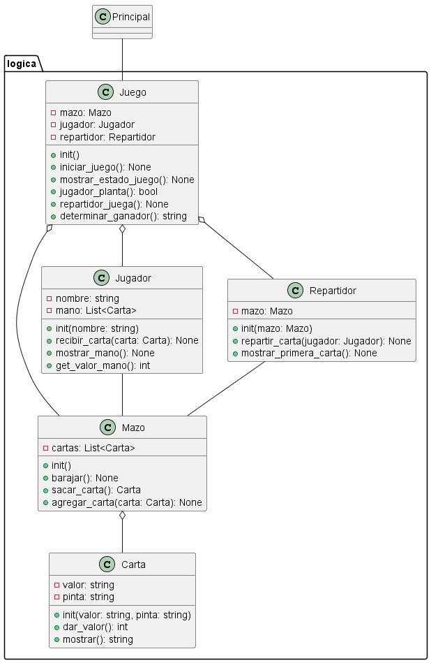
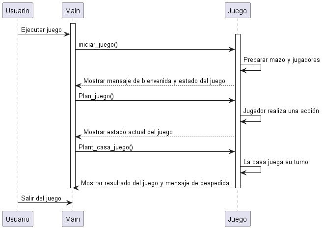

# DIAGRAMAS UML BLACKJACK

## INTEGRANTES

- Maria José Patiño Vera 20232020053
- Luis Santiago Mesa Bautista 20232020041
- Dikson Javier Castillo Triviño 20232020115

## Introducción
Los Diagramas de Modelado Unificado (UML) son una herramienta esencial en el diseño y desarrollo de software, permitiendo a los equipos de desarrollo visualizar, diseñar y comunicar la estructura y el comportamiento de un sistema de software. En este contexto, hemos utilizado UML para modelar un juego de blackjack, un popular juego de cartas de casino.

## Propósito
Los diagramas UML que hemos creado tienen varios propósitos específicos para nuestro juego de blackjack:

### Visualización de la Estructura del Juego: 
El diagrama de clases UML nos permite visualizar la estructura estática del juego, incluyendo las clases carta, mazo, Juego y Main, así como las relaciones entre ellas. Esto nos ayuda a entender cómo están organizadas las diferentes partes del juego y cómo interactúan entre sí.

### Representación de la Interfaz del Juego: 
El diagrama de secuencia UML muestra la interacción entre el usuario y el juego a través de la clase Main. Esto incluye la ejecución del juego, la realización de acciones por parte del jugador y la respuesta del juego, así como la salida del juego.

### Descripción de los Casos de Uso: 
El nuevo diagrama de casos de uso UML proporciona una visión general de las diferentes acciones que pueden llevarse a cabo en el juego de blackjack. Esto incluye desde iniciar el juego, repartir cartas, realizar un conteo de cartas, hasta verificar al ganador y continuar el juego.

## Tipos de diagramas UML utilizados:
Hemos utilizado tres tipos principales de diagramas UML para modelar nuestro juego de blackjack:

### Diagrama de Clases: 
Este diagrama representa la estructura estática del juego, mostrando las clases y sus relaciones. En nuestro caso, hemos representado las clases carta, mazo, Juego y Main, así como las relaciones entre ellas.

### Diagrama de Secuencia: 
Este diagrama muestra la interacción entre el usuario y el juego a lo largo del tiempo, representando la secuencia de mensajes intercambiados entre las clases Usuario, Main y Juego durante la ejecución del juego.

### Diagrama de Casos de Uso: 
El nuevo diagrama de casos de uso proporciona una descripción de alto nivel de las acciones que pueden llevarse a cabo en el juego de blackjack, ayudando a comprender las funcionalidades del sistema desde la perspectiva del usuario.

## Conclusiones
Los diagramas UML son una herramienta invaluable en el diseño y desarrollo de software, permitiendo a los equipos de desarrollo comprender, comunicar y colaborar en la creación de sistemas de software complejos como nuestro juego de blackjack. En este caso, hemos utilizado UML para modelar la estructura, la interfaz y las funcionalidades del juego, proporcionando una visión clara y detallada de su diseño y funcionamiento.
